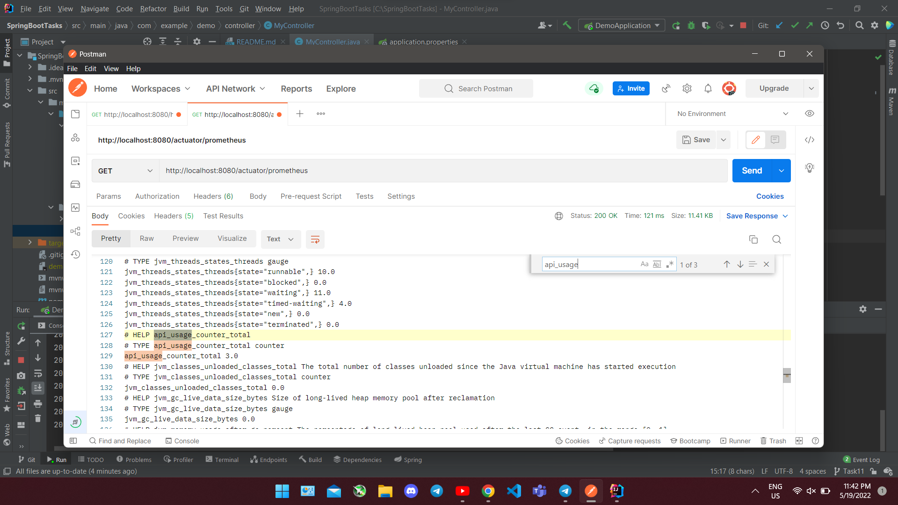
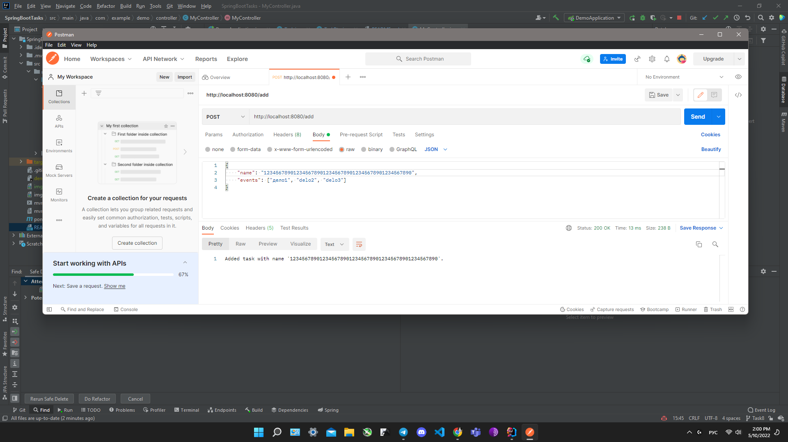

#Fourth Homework

1) Создать 3 профиля - dev, test, prod, каждый из которых будет включать в себя:
* 1.1) конфиг с листом из нескольких значений
* 1.2) название приложения
* 1.3) конфиг с переменной окружения, по дефолту значение - default
2) 3 бина:
* 2.1) один создается, только если профиль test,
* 2.3) другой, если существует первый бин,
* 2.3) третий, если в конфиге с не “default” (тут в идеале со скриншотом)

##При !default конфиге (также видно вывод трех зависимых друг от друга бинов из 2 части задания)

##При default конфиге

Приложение упало, т.к. бин isNotDefault не был создан.