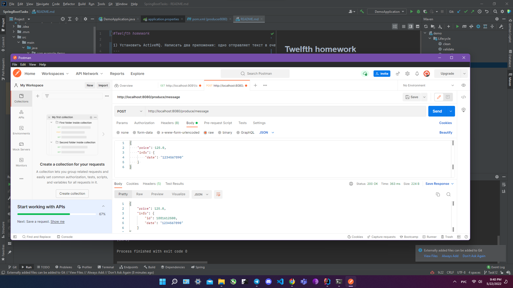
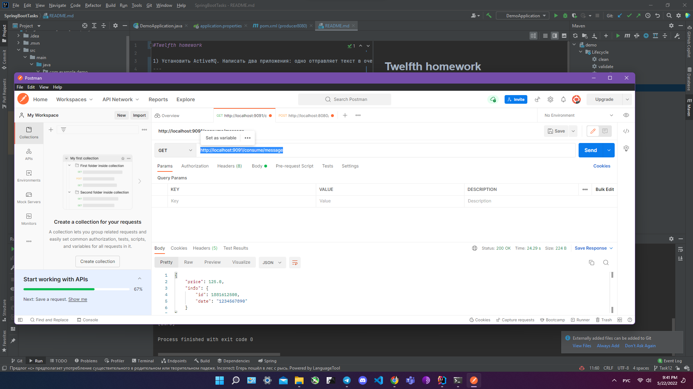

#Tenth homework

Реализовать приложение с разделением прав доступаАПИ:
- public/api - доступ разрешен для всех
- admin/api - доступ разрешен для пользователей с ролью admin
- support/api - доступ разрешен для пользователей с ролью support
---
Все приватные АПИ должны возвращать имя и роль пользователя
Хранение пользователей в памяти приложения (использование InMemoryUserDetailsManager)
Для хеширования паролей использовать BCryptPasswordEncoder
Basic аутентификация
---
### admin

### support

### public
