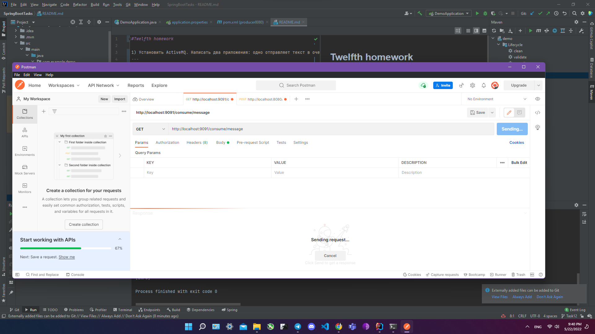

#Eighth homework

1) Создать контроллер, в котором:
* endpoint, который на вход будет принимать данные в виде:
  <code>
  {
  "name": "Мой список дел",
  "events": ["дело1", "delo2", "delo3"]
  }
  </code>
  валидировать их и сохранять в базу
* endpoint, который будет отдавать данные из бд в виде:
  <code>
  [
  {
  "name": "Мой список дел",
  "events": ["дело1", "delo2", "delo3"]
  },
  {
  "name": "Мой список дел2",
  "events": ["дело1", "delo2", "delo3"]
  }
  ]
  </code>
2) Спроектировать структуру БД для этих данных. В качестве БД можно взять любую БД
---
Пруф работы Валидации:
>!
Не работает, т.к. максимальная длина имени -- 50 символов
---
> 
Теперь работает.