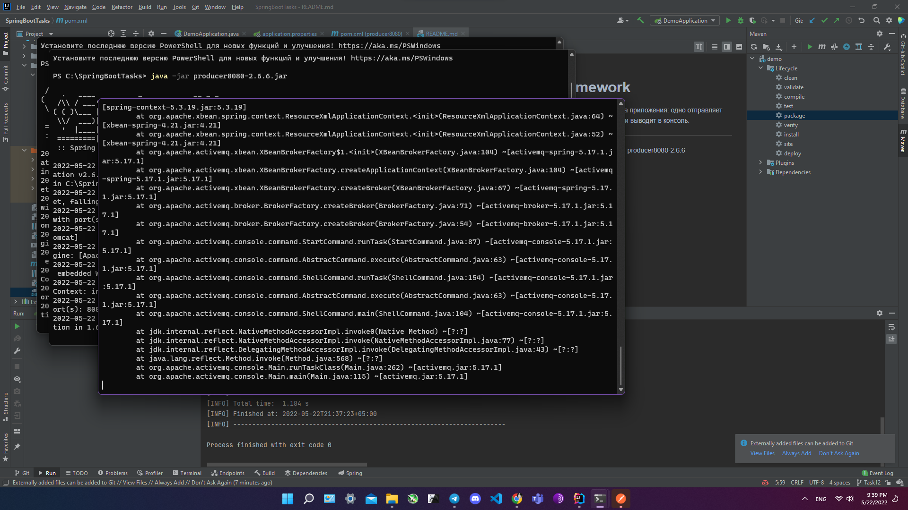

#Twelfth homework

1) Установить ActiveMQ. Написать два приложения: одно отправляет текст в очередь, другое читает его и выводит в консоль.
---
- Запускаем ActiveMQ, listener9091-2.6.6, producer8080-2.6.6

- Отправляем GET запрос на http://localhost:9091/consume/message и видим, что ничего не происходит

- Отправляем POST на http://localhost:8080/produce/message

- Проверяем вкладку с http://localhost:9091/consume/message

- Видим, что наш customer с другого порта получил отправленный json на другой порт
---
Также скрин с http://localhost:8161/admin

